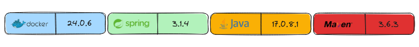
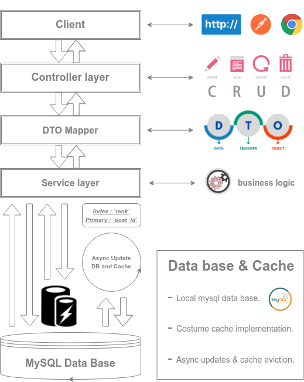

# Hacker News RESTFul API

<p align="center">
  
</p>

## Project Overview

The Hacker News project is a lightweight system similar to Hacker 
News web site that allows users to post text-based news, up vote/down vote posts, and view a 
list of top posts. RESTful API that support CRUD operation such as: POST, PUT, GET(all and top top posts), DELETE, PATCH(up vote down and change post).


## Requirements

1. Support simple text-based news posts.

2. RESTful API to handle CRUD operations, including creating, updating, reading, upvoting, and downvoting posts.

3. Storage Engine: MySQL local or cloud.

4. Implementation Language: [Java](https://www.java.com/en/).

5. FrameWork: [Spring boot](https://spring.io/projects/spring-boot) and Java.

6. Efficient retrieval of `top posts` from the storage engine.

7. Costume cache implementation to manage entities.

8. Dockerization of the project to containers: both the REST API service and the storage engine.

9. Unit tests and integration for the system.

## Main entities

**News Post:**

Attributes:

* `postId`: Unique identifier for each news post.
* `postedBy`: Username of the user who created the post.
* `post`: The text content of the news post.
* `link`: URL link related to the post.
* `creationTime`: Timestamp indicating when the post was created.
* `timeElapsed`: Time elapsed since post creation.
* `rank`: A numeric value calculated based on the post's votes and creation time.
* `votes`: The count of votes (upvotes and downvotes) received by the post.

**Client request:**

Attributes:

* `postedBy`: User name (username) of the user creating the post.
* `post`: The text content of the news post.
* `link`: A URL link associated with the post.

- NOTE:  fOR PATCH request the client entity will be only `post` and `link` to change.

**Server response:**

Attributes:

* `postId`: The unique identifier for the news post.
* `postedBy`: The username of the user who created or updated the post.
* `post`: The text content of the news post.
* `link`: The URL link associated with the post.
* `timeElapsed`: Time elapsed since the post was created, similar to * the "News Post" entity.
* `votes`: The count of votes (upvotes and downvotes) received by the post.

## Features

- Hourly asynchronous updates of the database and cache eviction.
- Configurable `cache-size`, `top posts list size`, `async update interval`, `async initial delay`.
- Get Top Posts Special method, calculated from the time of post and its votes.
- Costume caching mechanism to enhances performance for client requests of `top-posts` end point.
- Indexing on the database `rank` for optimized performance for `top-posts` end point.

<br>

<p align="center">
  
</p>

<br>

# Usage
To utilize this Spring Boot REST API project, follow these steps:

### Prerequisites
Before you begin, ensure you have the following prerequisites installed on your system:

- **Java (JDK):** If you don't have Java installed, you can download and install it from the official website:
  - [Download Java for Windows](https://www.oracle.com/java/technologies/javase-downloads.html) (Windows)
  - [Download Java for macOS](https://www.oracle.com/java/technologies/javase-downloads.html) (macOS)
  - [Download Java for Linux](https://openjdk.java.net/install/) (Linux)

- **Maven:** If you don't have Maven installed, you can download and install it from the official website:
  - [Download Maven](https://maven.apache.org/download.cgi)

- **MySQL Database:** The project uses a MySQL database for data storage. Make sure you have MySQL installed and running on your system.
  - [Download MySQL](https://dev.mysql.com/downloads/mysql/)

- **Docker and Docker Compose:** If you prefer to run the project using Docker containers, make sure you have Docker and Docker Compose installed on your system.

  - [Download Docker](https://docs.docker.com/get-docker/)
  - [Download Docker Compose](https://docs.docker.com/compose/install/)

### You can choose to run the project natively or with Docker, depending on your preference and system configuration.

# Installation

1. **Clone or Download the Repository:**
   You can clone this Git repository or download it as a ZIP file to your local machine.

``` shell
git clone https://github.com/YamtalDev/HackerNews-API.git
cd HackerNews-API

```

2. **Database and caching configuration:**
Open the src/main/resources/application.properties file and configure your MySQL 
database URL, username, password, `cache.size`, `cache.top-posts-size`, `async.update.interval`, `async.initial-delay`:

``` shell

spring.datasource.url=jdbc:mysql://localhost:3306/<your-database-name>
spring.datasource.username=<your-username>
spring.datasource.password=<your-password>

# Application Configuration
# Define the initial delay and update interval for asynchronous tasks.
app.async.initial-delay = 0          # Immediately invoked at start up 
app.async.update.interval = 3600000  # Every hour

# Cache Configuration
# Define the maximum cache size and size of the topPosts list.
app.cache.size=600
app.cache.top-posts-size=5

```
3. **Database:** 
After you configured your data base settings in the application.properties file, make sure your local mysql database is up and running and you have a data base named after what you passed as an argument to `jdbc:mysql://localhost:3306/<your-database-name>`.

``` shell

sudo service mysql start
sudo service mysql status
mysql -u root -p

```

4. **Compile the Project:**
Use Maven to compile the project:

``` shell

mvn compile

```

5. **Run Tests:** The test are written as stabs right now and have to be implemented(see TODO list at the end of the README file).

Run the project's tests to ensure everything is working as expected:

``` shell

mvn test

```

#### NOTE: You can find a postman collection in the root directory of the project.

6. **Run the Project:**

Start the project using Maven:

``` shell

mvn spring-boot:run

```

## Spin up with Docker

1. Make sure that you do not have any process that is running on ports: 8080 and 3306.

``` shell

sudo lsof -i :3306 && sudo lsof -i :8080

```

If you do have processes active on these ports please kill them using `kill proc_pid`

2. Run the Docker Containers:
Start the Docker containers for the application and the MySQL database:

``` shell

docker-compose up

```

# Access the API using http CRUD operations

You can access the API by sending HTTP requests to http://localhost:8080/api/news from your local machine.

## Create a New Post

### Request

``` http
POST http://localhost:8080/api/news
Content-Type: application/json

{
    "postedBy": "User",
    "post": "This is a new post",
    "link": "https://some_website.com"
}

```


## Read a Post by ID
### Request

``` http
GET http://localhost:8080/api/news/1

HTTP/1.1 200 OK
Content-Type: application/json

{
    "postId": 1,
    "postedBy": "User",
    "post": "This is a new post",
    "link": "https://some_website.com",
    "timeElapsed": "just now",
    "votes": 0
}

```

## Update a Post by ID
### Request

``` http

PUT http://localhost:8080/api/news/1
Content-Type: application/json

{
    "postedBy": "Updated_user",
    "post": "Updated post content",
    "link": "https://updated_website.com"
}

```

## Delete a Post by ID
### Request

``` http

DELETE http://localhost:8080/api/news/1

HTTP/1.1 200 OK
Content-Type: text/plain

"Post deleted"

```

## Change a Post by ID (Partial Update)
### Request

``` http

PATCH http://localhost:8080/api/news/1
Content-Type: application/json

{
    "post": "Changed post content",
    "link": "https://changed-example.com"
}

```

## Get All Posts
### Request

``` http

GET http://localhost:8080/api/news

HTTP/1.1 200 OK
Content-Type: application/json
[
        {
            "postId": 1,
            "postedBy": "User",
            "post": "This is a new post",
            "link": "https://some_website.com",
            "timeElapsed": "just now",
            "votes": 0
        },
        {
            "More posts..."
        }
]

```

## Get Top Posts
### Request
* The response will be a page of size of the entities the user has configured in the application.property, see installation phase above. Posts "Hotness" is calculated 
based on the post votes and number of hours past from the post creation(`timeElapsed`).

``` http

GET http://localhost:8080/api/news/top-posts

HTTP/1.1 200 OK
Content-Type: application/json

{
    "content": [
        {
            "postId": 1,
            "postedBy": "User1",
            "post": "This is a new post!",
            "link": "https://some_website.com",
            "timeElapsed": "just now",
            "votes": 7
        },
{
            "postId": 34,
            "postedBy": "User",
            "post": "This is a new post",
            "link": "https://some_website.com",
            "timeElapsed": "2 hours ago",
            "votes": 24
        },
{
            "postId": 6,
            "postedBy": "User",
            "post": "This is a new post",
            "link": "https://some_website.com",
            "timeElapsed": "1 hour ago",
            "votes": 16
        },
        
        {
            "More posts..."
        }
    ],
    "pageable": {
        "pageSize": 30,
        "pageNumber": 0
    }
}

```

## downvote/upvote a Post by ID
### Request

``` http

PATCH http://localhost:8080/api/news/1/downvote
PATCH http://localhost:8080/api/news/1/upvote

HTTP/1.1 200 OK
Content-Type: application/json

{
    "postId": 1,
    "postedBy": "User",
    "post": "This is a new post",
    "link": "https://some_website.com",
    "timeElapsed": "just now",
    "votes": 1
}

```

# Learning resources

- [Learn Java](https://www.youtube.com/watch?v=BGTx91t8q50&t=10332s)
- [Learn Docker](https://docs.docker.com/get-started/overview/)
- [MySQL Local DB](https://dev.mysql.com/doc/mysql-getting-started/en/)
- [DTO Model mapper](https://www.geeksforgeeks.org/spring-boot-map-entity-to-dto-using-modelmapper/)
- [Data base Indexing](https://www.baeldung.com/jpa-indexes)
- [Spring RESTFul API](https://spring.io/guides/tutorials/rest/)
- [Spring documentation](https://docs.spring.io/spring-framework/reference/index.html)
- [Concurrent Collections](https://docs.oracle.com/javase/tutorial/essential/concurrency/collections.html)
- [In Memory Cache in Java](https://crunchify.com/how-to-create-a-simple-in-memory-cache-in-java-lightweight-cache/)
- [Constructor dependency injection](https://www.baeldung.com/constructor-injection-in-spring)
- [Hacker News `top posts` algorithm](https://medium.com/hacking-and-gonzo/how-hacker-news-ranking-algorithm-works-1d9b0cf2c08d)
- [Dockerize Spring boot and MySQL application](https://ilkerguldali.medium.com/1-4-lets-create-a-spring-boot-app-with-mysql-docker-docker-compose-8acaee3a2c4d)


# TODO

- [ ] Implement comments count and posting of comments.
- [ ] Improve the logic of the `timeElapsed` calculation.
- [ ] Add restrictions for 1 upvote and 1 downvote per post.
- [ ] Write benchmark tests to ensure efficiency and scalability of the API.
- [x] Find a way to hide the secrets and still be able to docker compose the app.
- [x] Implement a mechanism to update the cache of top posts when the data changes.
- [ ] Implement database schema to make data base migration easy using `schema.sql`.
- [ ] Integrate Spring Security to enhance API security and protect against vulnerabilities.
- [ ] Write all the test cases needed to ensure edge cases are being taking care in the code.
- [x] Explore alternative algorithms for fetching top posts, incorporating `post_id` for ranking.
- [ ] Move String timeElapsed to the response DTO responsibility and have a simple long as elapsed time.
- [ ] Handling lower-level database exceptions instead of using `if` statements in upvote/downvote logic.

## License:
This project is licensed under the MIT License. See the [LICENSE](LICENSE) file for details.

## Contact:
For questions or issues, feel free to [create an issue](https://github.com/YamtalDev/HackerNews-API/issues) or contact the project maintainer.